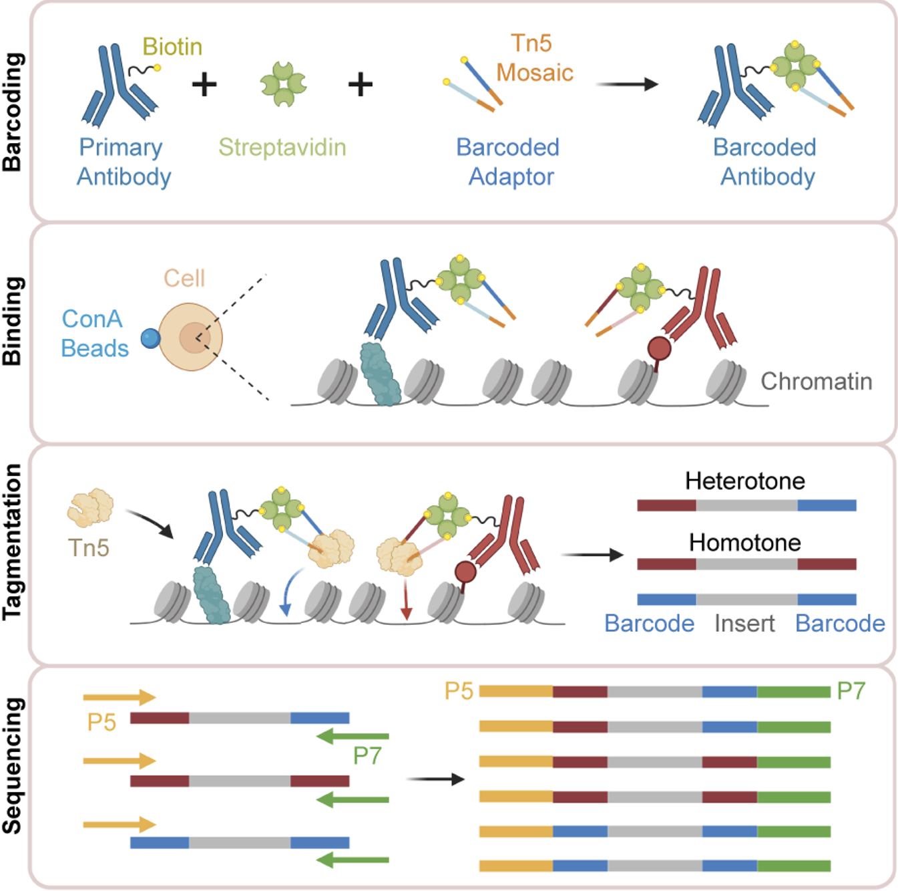

# Hi-Plex CUT&Tag
---
This is a public repository for all code connected to Hi-Plex CUT&Tag.

Please cite: Liao, Yuan, et al. "Global Mapping of Combinatorial Chromatin Regulatory Events Using Hi-Plex CUT&Tag." bioRxiv (2025): 2025-10. doi: https://doi.org/10.1101/2025.10.06.680180

Schematic workflow
---

