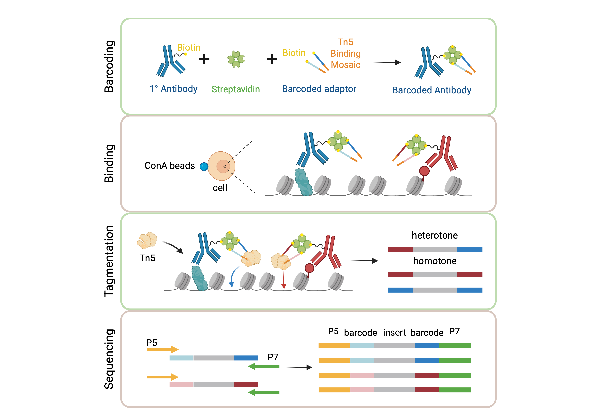

# Hi-Plex CUT&Tag

This is a public repository for all code connected to Hi-Plex CUT&Tag.

Please cite: Liao, Yuan, et al. "Global Mapping of Combinatorial Chromatin Regulatory Events Using Hi-Plex CUT&Tag." bioRxiv (2025): 2025-10. doi: https://doi.org/10.1101/2025.10.06.680180

Schematic workflow
---

## Repository structure

preprocess/  Processing raw sequencing files to bam files, bigwig files (for signal tracks), peak regions.  
enrichment_heatmap/  Scripts for Figure 1DF  
peak_count_heatmap/  Scripts for Figure 2B  
peak_annotation/ Scripts for Figure 2C, Figure 3B  
fragment_decomposition/  Scripts for Figure 2D  
bicluster/   Scripts for Figure 3A  
whole_genome_count/  Scripts for Figure 3A  
highly_variable_regions/ Scripts for Figure 3A  
TF_binding_site_enrichment/  Figure 3C  
gene_expression_prediction_model/    Scripts for Figure 4,5  
differential_analysis/   Scripts for Figure S5  
single_cell/ Scripts for Figure 6

## Dependencies

Analysis was performed in R (>= 4.3) with the following packages
data.table
fread
fwrite
data.table
as.data.table
setDT
set
setnames
setcolorder
setkey
setindex
rbindlist
BiocParallel
BiocGenerics
GenomicRanges
ComplexHeatmap
S4Vectors

And also in Python (>= 3.9) with the following packages
numpy
pandas
pyarrow
scikit-learn
qnorm

## Quick start (overview)

The current repository contains the exact scripts used for the analyses in the paper.A frozen release with example data and step-by-step instructions for reproducing key analyses will be made available during peer review (e.g. via Zenodo). Reviewers are welcome to inspect the code structure; we will be happy to provide additional documentation or demo scripts upon request.